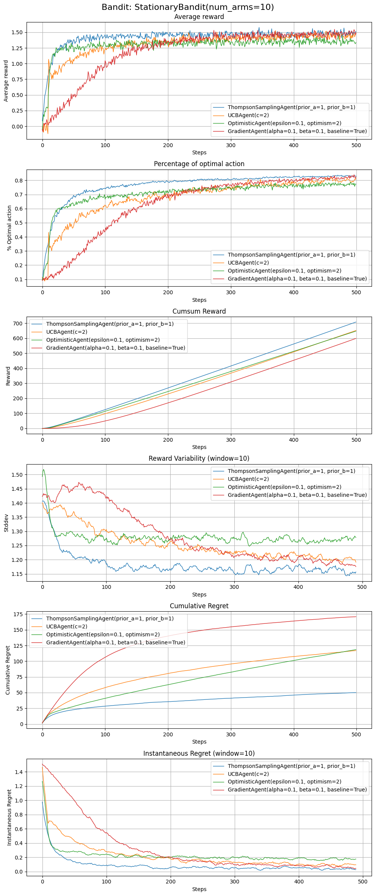

<div align="center">
  
</div>


# Multi-Arm Bandit Exploration

Welcome to my repository dedicated to exploring various Multi-Arm Bandit (MAB) algorithms. This is a 
collection of implementations that I've built during my study and experiments with different MAB strategies. 
It aims to provide an overview of both classic and some advanced techniques for bandit algorithms. 


I hope this repository offers valuable insights and practical code examples whether you're new to reinforcement learning 
or looking to deepen your understanding of specific bandit algorithms.

## 🤖 Agents

The repository features implementations of the following bandit agents, catering to a range of scenarios from 
stationary to non-stationary environments:

- **Epsilon Greedy**: Balances exploration and exploitation by selecting the best-known action most of the time, but 
- exploring randomly at a defined epsilon rate.
- **Weighted Average**: Utilizes a weighted average to update estimates, giving more weight to recent rewards.
- **Optimistic Initial Values**: Encourages exploration through optimistic initial value settings for each action.
- **Upper Confidence Bound (UCB)**: Selects actions based on a balance of their estimated rewards and uncertainty, 
- promoting exploration of less-known actions.
- **Sliding Window UCB**: Adapts UCB for non-stationary environments by considering only recent observations within a 
- sliding window.
- **Gradient-Based**: Uses a preference-based system influenced by received rewards to make action selections.
- **Thompson Sampling**: Utilizes a probabilistic approach for action selection, based on the Bayesian inference of the 
- reward distributions.
- **Gaussian Process Kernel Bandits**: Implements a bandit strategy using Gaussian processes to model the reward 
- function with kernel functions.
- **Exp3**: Designed for adversarial bandit problems, it employs an exponential update rule to manage exploration and 
- exploitation in changing environments.

## 🎰 Bandit Environments

To test and evaluate the performance of the above agents, the repository includes implementations for the following types 
of bandit environments:

- **Stationary**: The reward probabilities of each arm remain constant throughout the experiment.
- **Non-Stationary**: The reward probabilities of each arm change over time, requiring the agents to adapt their strategies 
- dynamically.

## 🧪 Experiments and Simulations

The repository also contains classes and scripts designed to facilitate experiments and simulations with the implemented 
agents and environments. These tools allow for comprehensive analysis and comparison of different strategies under various conditions.

### Metrics and Visualisations
- **Average Reward**: Measures the mean reward received by an agent at each step, providing insight into its overall efficiency.
- **Optimal Actions**: Tracks the frequency with which an agent selects the best possible action, offering a direct measure of its decision-making accuracy.
- **Cumulative Rewards**: The total reward accumulated over time, highlighting an agent's long-term performance.
- **Reward Variability**: Assesses the standard deviation of rewards received, indicating the consistency of an agent's performance.
- **Cumulative Regret**: Calculates the difference between the theoretical maximum cumulative reward and the agent's cumulative reward, offering a perspective on missed opportunities.
- **Instantaneous Regret**: Focuses on the regret experienced at each individual step, providing a granular view of an agent's decision-making process over time.

<div align="center">
  
</div>


## 📚 Getting Started

To dive into the world of multi-arm bandits with this repository, clone it to your local machine using:

```bash
git clone <repository-url>
```

### Example
```python
from simulation import Simulations
from bandits import StationaryBandit, NonStationaryBandit
from agents import (
    EGreedyAgent, 
    WeightedAgent, 
    OptimisticAgent, 
    UCBAgent, 
    GradientAgent, 
    ThompsonSamplingAgent, 
    SlidingWindowUCBAgent,
    GPKernelAgent,
    EXP3Agent
)

sim_configs = {
    'runs': 1000,
    'steps': 500,
    'arms': 10,
    'bandit': StationaryBandit,
    'bandit_args': {},
    'agents': [
        {
            'agent': ThompsonSamplingAgent,
            'args': {'prior_a': 1, 'prior_b': 1}
        },
        {
            'agent': UCBAgent,
            'args': {'epsilon': .05, 'c': 2}
        },
        {
            'agent': OptimisticAgent,
            'args': {'optimism': 2}
        },
        {
            'agent': GradientAgent,
            'args': {'alpha': .2, 'beta': .2}
        },
    ]
}

sim = Simulations(**sim_configs)
sim.run()
sim.visualise()
```

## 📖 Further Reading
Check out Sutton and Bartos book [Reinforcment Learning: An Introduction](http://incompleteideas.net/book/RLbook2020.pdf)

For those looking to deepen their understanding of multi-arm bandits, the repository is complemented by documentation 
and comments within the code, providing insights into the workings and applications of each algorithm.

## 🤝 Contributing
Contributions are welcome! Whether it's adding new bandit strategies, enhancing the existing implementations, or improving the documentation, your input is valuable. Please feel free to fork the repository, make your changes, and submit a pull request.

Thank you for visiting this repository. Happy exploring!